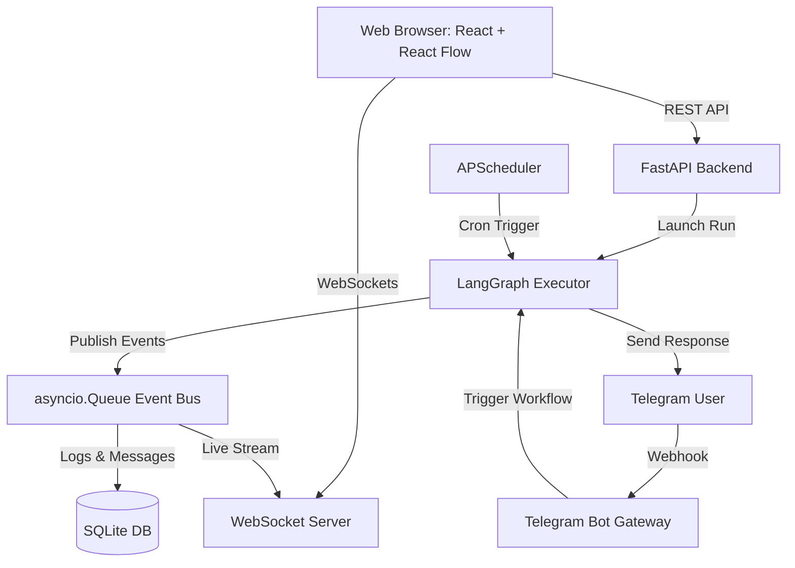

# 🤖 AI Agent Orchestration Platform

A visual stateful multi-agent orchestration workspace built using LangGraph, FastAPI, and React Flow. Users can visually design, execute, and monitor collaborative agent topologies that communicate asynchronously, utilise tool skills, persist conversations, and integrate with external messaging interfaces (like Telegram).

---

## 1. System Architecture

The platform separates frontend building, server routing, and graph state machine executors:



---

## 2. Tech Stack & Justifications

| Layer | Technology | Why |
| :--- | :--- | :--- |
| **Orchestrator** | **LangGraph** | Standard state stateful graph transition, support loops, conditional paths, and human-in-the-loop steps. |
| **Inference Provider** | **Groq Cloud** | High-performance, low-latency, OpenAI-compatible free API endpoints. |
| **Local LLM Fallback** | **Ollama** | 100% offline local model inference without requiring external API keys. |
| **Backend Framework** | **FastAPI** | High-performance asynchronous execution, native WebSockets support, automatic OpenAPI specs. |
| **Database** | **SQLite + SQLModel** | Flat-file local SQL database, WAL mode enabled for concurrent async updates. |
| **Frontend UI** | **React + Vite + TS** | Speedy hot-module reloading and clean TypeScript compilation. |
| **Visual Builder** | **React Flow** | Battle-tested library to visually drag, drop, and wire node topologies. |
| **State Store** | **Zustand** | Lightweight react state manager. |
| **Containerization** | **Docker Compose** | Single-command deployment mapping backend, frontend, and database volumes. |

---

## 3. Getting Started

### Prerequisites
Ensure you have the following installed:
- **Docker & Docker Compose** (Recommended for single-command setup)
- **OR** **Python 3.11** + **Node.js 18+** (For manual setup)
- **ngrok** (Required if exposing local port to receive Telegram updates)

### Quick Start (Docker Compose)
1. Clone this repository to your workspace.
2. Duplicate `.env.example` as `.env` and fill in your keys:
   ```bash
   cp .env.example .env
   ```
3. Boot the docker stack:
   ```bash
   docker-compose up --build
   ```
4. Access the web dashboard at: [http://localhost:3000](http://localhost:3000).

---

## 4. Manual Local Installation

### A. Backend Setup
1. Create a Python virtual environment and activate it:
   ```bash
   python -m venv venv
   # On Windows:
   .\venv\Scripts\activate
   # On macOS/Linux:
   source venv/bin/activate
   ```
2. Install Python packages:
   ```bash
   pip install -r backend/requirements.txt
   ```
3. Set your variables in `.env` (refer to `.env.example`).
4. Boot the FastAPI API server:
   ```bash
   uvicorn backend.main:app --host 0.0.0.0 --port 8000
   ```

### B. Frontend Setup
1. Navigate to the `frontend/` directory:
   ```bash
   cd frontend
   ```
2. Install npm dependencies:
   ```bash
   npm install
   ```
3. Run the development Vite server:
   ```bash
   npm run dev
   ```
4. Access the UI at: [http://localhost:5173](http://localhost:5173) (Vite default dev port).

---

## 5. Integrations & Guides

### A. Acquiring a Free Groq API Key
1. Visit the [Groq Console](https://console.groq.com/).
2. Create a free account or login.
3. Navigate to **API Keys** and click **Create API Key**.
4. Copy the key and paste it as `GROQ_API_KEY` in your `.env`.

### B. Configuring a Telegram Bot Messenger
1. Message [@BotFather](https://t.me/BotFather) on Telegram and type `/newbot`.
2. Give your bot a name and a username, then copy the generated `API token`.
3. Paste the token as `TELEGRAM_BOT_TOKEN` in your `.env`.
4. Open your terminal and start an HTTPS tunnel using `ngrok` pointing to your backend:
   ```bash
   ngrok http 8000
   ```
5. Copy the generated `https://...` forwarding URL.
6. Paste the URL as `TELEGRAM_WEBHOOK_URL` in your `.env`.
7. Boot/reboot your FastAPI server. The startup hook will automatically trigger the Telegram webhook registration!

---

## 6. Developer Extension Reference

### A. How to Add a New Workflow Template
1. Create a JSON schema file inside `backend/templates/` (e.g. `customer_support.json`).
2. Follow this structure:
   - `name`: Human-readable name.
   - `description`: Summary of the template.
   - `agents`: List of agent configurations (name, role, system prompt, temperature, tools).
   - `graph_json_template`: Visual React Flow wiring structure mapping node trigger, conditions, agent placements, and endings.
3. Add the key name of the JSON file to `seed_templates()` in `backend/main.py` so that it is initialized in SQLite on startup.

### B. How to Add a New Messaging Channel
1. Create a Python module inside `backend/channels/` (e.g. `slack.py` or `whatsapp.py`).
2. Expose a webhook endpoint inside your router (e.g., `POST /webhook/slack`).
3. Query the DB to find the agent containing `channel == "slack"`.
4. Trigger the LangGraph execution calling `execute_workflow(workflow_id, input_data)`.
5. Dispatch the final response payload back to the messaging provider's API.

### C. How to Add a New Tool Skill
1. Define a python helper function inside `backend/runtime/tools/` (e.g., `database_fetch.py`).
2. Standardize inputs, outputs, and add docstring details for the LLM's function definition parsing.
3. Import and map the function in the `TOOL_FUNCTIONS` registry inside `backend/runtime/tools/__init__.py`.
4. Register the tool name in `AVAILABLE_TOOLS` on the frontend `Agents.tsx` view so that it appears in the checkbox checklist.
