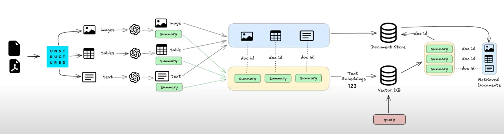

# 🧠 Multimodal RAG using LangChain, Ollama & Unstructured

This project implements a **Multimodal Retrieval-Augmented Generation (RAG)** pipeline that processes PDFs into structured representations—extracting **text**, **tables**, and **images**—using the `unstructured` library, then summarizes and indexes them using LangChain, stores the documents in a document store, and enables intelligent query answering via vector search using **Ollama (local LLM)**.

---

## 📌 Architecture

The following diagram illustrates the flow of data through the pipeline, including unstructured parsing, summarization, embedding, storage, and retrieval:

There are 3 ways to create Multimodal RAG shown in below image, we will be going through best of these 3 i.e Option-3

Option-3:

---

## 🔧 Features

- 📄 **PDF Ingestion** using `unstructured`
- 🖼️ **Multimodal Parsing**: Images, Tables, and Text
- 🤖 **LLM-based Summarization** using **Ollama**
- 🧠 **Embeddings + Vector Store** for similarity search
- 🔍 **RAG Pipeline** built with **LangChain**
- 🔁 **Local-first setup** (no cloud dependencies)

---

## Installation:
The PDF partitioning used by Unstructured will use:
We use Unstructured to partition it (see [blog post](https://blog.langchain.dev/semi-structured-multi-modal-rag/)).

- tesseract for Optical Character Recognition (OCR)
- poppler for PDF rendering and processing

Refer to poppler [installation instructions](https://pdf2image.readthedocs.io/en/latest/installation.html) and tesseract [installation instructions](https://tesseract-ocr.github.io/tessdoc/Installation.html) in your system.

---

## 📌 To-Do
-Integrate Streamlit or Gradio and FastAPI for UI

-Create a Modular production ready code
 

