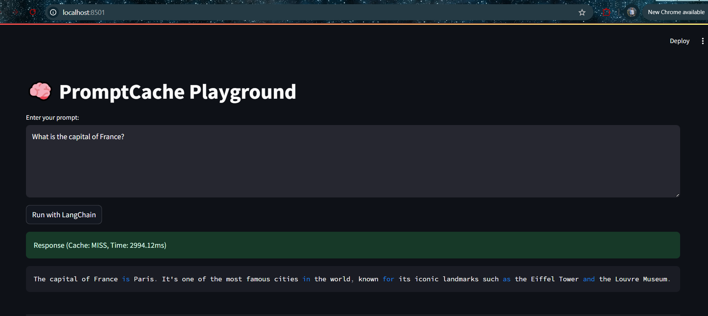
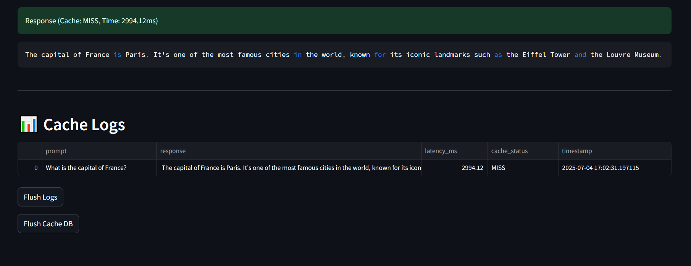
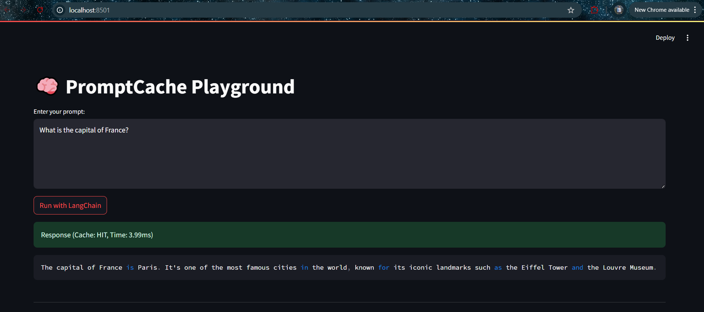
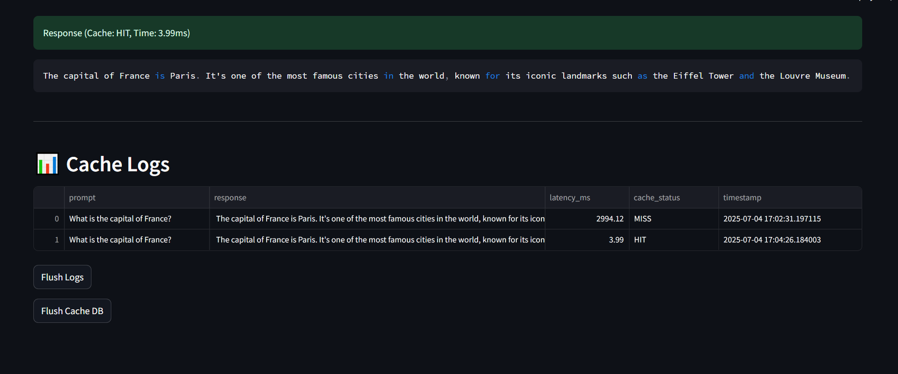

# 🧠 PromptCache Playground

## Table of contents
* [General info](#general-info)
* [Technologies](#technologies)
* [Setup](#setup).
* [Directory Structure](#directory-structure)
* [How It Works](#how-it-works)
* [Running the App](#running-the-app)

## General info
A local, fully offline LangChain + Ollama-powered app to demonstrate prompt caching, visualize cache hits/misses, and benchmark prompt latency — with a real-time UI built using Streamlit.

---

## 🚀 Features

- ⚡ **Prompt Caching via LangChain + SQLite**
- 🧠 **Local LLM via Ollama** (e.g., Mistral, LLaMA3)
- 📊 Real-time **cache HIT/MISS detection**
- 📝 **Prompt logs** (CSV) with latency + timestamps
- 🧹 Flush cache + logs instantly
- 🖥️ Beautiful and minimal **Streamlit UI**
- 🔁 Fully local, **no API keys or internet required**

---

## 📸 Demo

## Technologies
* GenAI
* LangChain
* Ollama
* Streamlit
* SQLite
* Python

## Setup
### Installation 
* Download and install Ollama from https://ollama.com/
* run commands: 
    ollama pull mistral
* pip install -r requirements.txt

## Directory structure
promptcache-playground/

├── app.py                  # Streamlit UI

├── prompt_runner.py        # Core logic (LLM, caching, logging)

├── cache_log.csv           # Prompt logs (auto-created)

├── .cache/                 # LangChain SQLite cache (auto-created)

## 🛠️ How It Works
🔁 Prompt Caching via LangChain
Uses SQLiteCache from LangChain

When a prompt is run:

If cached: fetch from SQLite

If not: LLM is invoked, and response cached

LLM used: Ollama(model="mistral") (can be changed)

🕵️ HIT/MISS Detection
Uses latency threshold (100ms) to infer if cache was hit

Alternatively, can use direct DB checks with lookup() (see advanced notes)

📝 Logging
All prompt runs are logged in cache_log.csv

## ▶️ Running the App
Start your local LLM (e.g., Mistral): 

ollama run mistral

Launch the Streamlit UI:

streamlit run app.py

